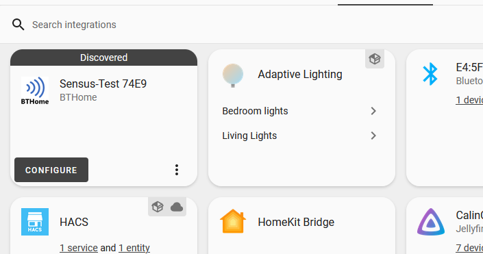

# Homeassistant integration

Simply click the button below to open your Homeassistant Integrations tab:

Due to Sensus using the [BTHome data format](https://bthome.io/), your device should automatically appear and present itself as configurable.
**If it doesn't, make sure you have the Bluetooth integration enabled in Homeassistant.**

## Entity explainations

Here's a table of all the entities and their respective meaning:

| Entity              | Description | 
| :---------------- |  :----- |
| Battery    |   A flag indicating if the battery has a low charge or not. Will indicate "Low" when battery is getting dangerously low or when temperature is really low (due to batteries performing poorly in low temperatures)   |
| Humidity          |   This is the relative air humidity, in percent, measured with the on-board SHTC3 sensor   |
| Illuminance    |  This is the illuminance level measured in lux with the on-board OPT3001 sensor   |
| Voltage |  This is the measured battery/supply voltage   |
| Temperature |  This is the on-board temperature, in degrees Celsius, measured by the onboard SHTC3 sensor.     Note: This entity is called "Temperature 1" when a soil probe is connected.   |
| Moisture |  **Probe only** - The soil moisture, in percent   |
| Temperature_2 |  **Probe only** - The soil temperature, in degrees Celsius   |