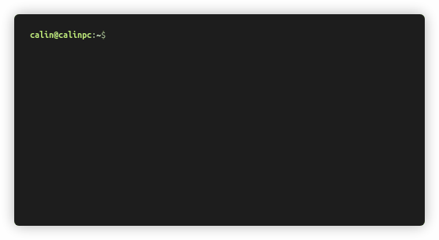

# Firmware Update 🧰

You need to have [sensus-cli](https://github.com/Ardelean-Calin/sensus-cli) downloaded somewhere on your computer.

Then, connect Sensus to your PC via USB-C and run

```
sensus update --port YOUR_PORT
```

Replace `YOUR_PORT` with the port at which Sensus is connected (for example `COMx` on Windows or `/dev/ttyUSBx` on Linux).

:::caution Very Important
Sensus will restart at the end of the update process. Do not interrupt that restart. You should only disconnect Sensus after
you see the message `Successfully updated to vXYZ`.
:::

The CLI will automatically search for the latest firmware version and update if necessary. While the update is taking place, you will see the green LED flashing.



Optionally,  you can force an update by specifying a .hex file. This is useful if you want to roll-back an update, for example.

`sensus update --port /dev/ttyUSB0 --hex sensus_v0.0.1.hex`

For more information about the update command and its supported options, type `sensus update --help` in your Terminal.